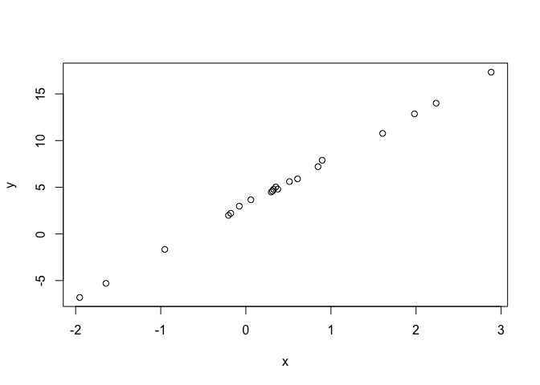

# R as Rmd
Tim  
October 24, 2017  


## We want R as Rmd
Let's test:


```r
x <- rnorm(20, 0, 1)
y <- 3 + 5*x + rnorm(20,0,0.2)
plot(x,y)
```

<!-- -->


---
title: "R_rmd.R"
author: "Tim"
date: "Tue Oct 24 19:14:16 2017"
---
